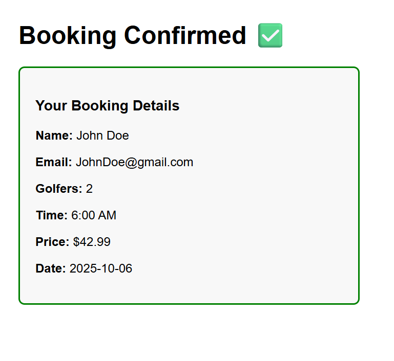

# Puzzles Golf Tee Time Booking

## Description
A MVP webpage where golfers can easily book tee times based on date and time. Once the golfer or user books their desired time, then the page is redirected showing their reservation with their information.


## Features

- Date and Time Selection
- Price range
- Number of Golfers
- Booking Form
- Booking Confirmation


## Installation

  1. Clone the repository:
        ```bash
        git clone git@github.com:tmchoe124/golf-tee-time.git
        ```
  2. Navigate to project folder:
        ```bash
        cd golf-tee-time
        ```
  3. Open index.html to use the app

## Screenshots

**Booking Form:**


**Booking Confirmation:**

